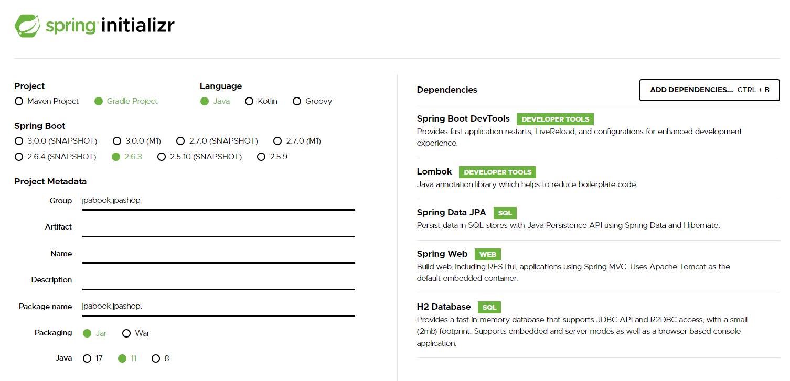

# 프로젝트 구성

GroupId
- GroupId는 프로젝트를 정의하는 고유한 식별자 정보
- GroupId는 보통 Java package name rules을 따른다.

 

ArtifactId
- 버전 없는 Jar파일 이름
- 특수문자는 사용할 수 없고, 소문자만 사용되어야 한다.

정리하자면, GroupId는 큰 틀을 의미하고, ArtifactId는 그 안에 작은 틀을 의미  
예를들어 회사에서 정산시스템을 만든다면, GroupId는 회사명, ArtifactId는 주문정산, 월급정산 등 이런식으로 정의할 수 있다.

